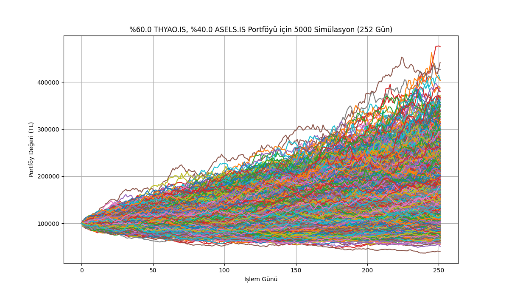
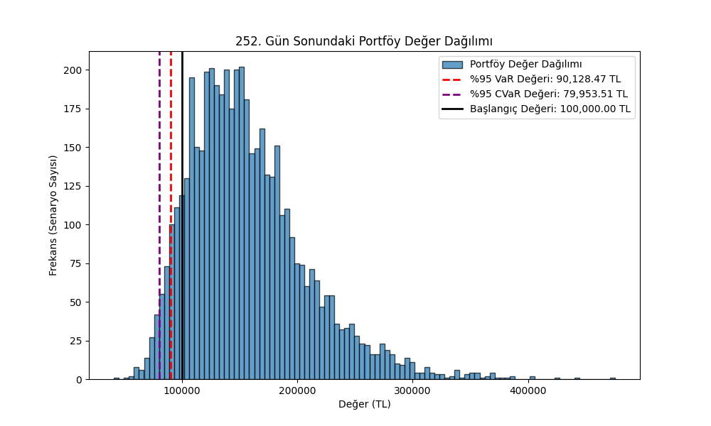

# Python ile Portföy Riski Monte Carlo Simülasyonu

Bu proje, belirlenen bir hisse senedi portföyünün (%60 THYAO.IS, %40 ASELS.IS) gelecekteki değer yollarını simüle etmek için Monte Carlo yöntemini kullanır. Simülasyon, hisseler arasındaki korelasyonu (Kovaryans Matrisi ve Cholesky Ayrıştırması kullanarak) dikkate alır.

Projenin temel amacı, portföyün 1 yıllık vadedeki riskini ölçmek için **Riske Maruz Değer (VaR)** ve **Koşullu Riske Maruz Değer (CVaR)** gibi kantitatif finans metriklerini hesaplamaktır.

## 🚀 Kullanılan Teknolojiler

- Python 3
- NumPy
- Pandas
- Matplotlib
- yfinance

## 🏁 Nasıl Çalıştırılır

1.  Gerekli kütüphaneleri yükleyin:
    ```bash
    pip install -r requirements.txt
    ```

2.  Python script'ini çalıştırın:
    ```bash
    python portfolio_risk_analyzer.py
    ```

3.  Script çalışacak, terminale risk raporunu basacak ve sonuç grafiklerini (`portfolio_paths.png` ve `portfolio_histogram.png`) klasöre kaydedecektir.

## 📊 Simülasyon Sonuçları

Aşağıda 5000 senaryoluk bir simülasyonun sonuçları gösterilmiştir.

### 1. Portföy Değer Yolları

Bu grafik, 100.000 TL'lik başlangıç portföyünün 1 yıl (252 gün) boyunca izleyebileceği 5000 farklı senaryoyu göstermektedir.



### 2. Vade Sonu Değer Dağılımı (Risk Analizi)

Bu histogram, 1 yılın sonundaki 5000 olası portföy değerinin dağılımını göstermektedir. %95 güven seviyesindeki VaR ve CVaR değerleri, potansiyel aşağı yönlü riski (kaybı) göstermek için işaretlenmiştir.

